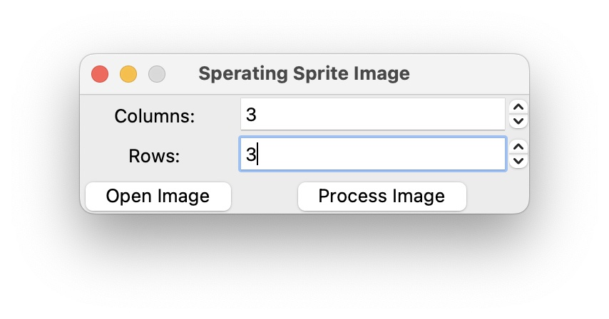

# Seperating Sprite Image

필요에 의해 만든 간단한 스프라이트 이미지 분할기 입니다.

## 기능

이미지를 불러와 원하는 개수로 이미지를 분할합니다.

이미지는 격자모양으로 분리되며, 가로 세로 칸의 개수를 지정하여 분리할 수 있습니다.



## 설치

python-poetry 모듈을 사용하여 의존성을 관리하고 있습니다.

poetry를 사용할 경우 다음과 같이 설치 하고 실행 할 수 있습니다.

```shell
# 의존성 설치
$ poetry install

# 가상 환경 활성화
$ poetry shell

# 프로그램 실행
$ python src/main.py
```

poetry 없이 사용하고자 할 경우, 다음의 요구조건을 충족시켜 사용할 수 있습니다.

- Python 3.10
- [Pillow 9.2.0](https://pillow.readthedocs.io/en/stable/installation.html)

실행은 src/main.py 스크립트를 실행하면 됩니다.

## 예시

원본:


3x3 분할:

<table>
    <tr>
        <td></td>
        <td></td>
        <td></td>
    </tr>
    <tr>
        <td></td>
        <td></td>
        <td></td>
    </tr>
    <tr>
        <td></td>
        <td></td>
        <td></td>
    </tr>
</table>